# ChatMemory Architecture

This document provides a visual representation of the ChatMemory architecture using Mermaid diagrams.

## Component Interaction Diagram

```mermaid
classDiagram
    class ChatMemoryStrategyType {
        <<enumeration>>
        MESSAGE
        PROMPT
        VECTOR
    }
    
    class ChateMemoryStrategy {
        +ChatMemoryStrategyType type
        +Boolean mandatory
    }
    
    class ChatMemory {
        <<interface>>
        +add(String conversationId, Message message)
        +add(String conversationId, List~Message~ messages)
        +get(String conversationId, int lastN)
        +clear(String conversationId)
    }
    
    class CaffeineChatMemory {
        -Cache~String, List~Message~~ messageCache
        -Map~String, Integer~ maxMessageCounts
        +add(String conversationId, List~Message~ messages)
        +get(String conversationId, int maxMessages)
        +clear(String conversationId)
    }
    
    class InMemoryChatMemory {
        +add(String conversationId, Message message)
        +add(String conversationId, List~Message~ messages)
        +get(String conversationId, int lastN)
        +clear(String conversationId)
    }
    
    class MinionHybridMemory {
        +add(String conversationId, Message message)
        +add(String conversationId, List~Message~ messages)
        +get(String conversationId, int lastN)
        +clear(String conversationId)
    }
    
    class ChatMemoryFactory {
        -int defaultMaxMessages
        -int defaultExpirationHours
        -String defaultMemoryType
        -VectorStoreProvider vectorStoreProvider
        +createChatMemory(ChatMemoryStrategyType strategyType)
        +createDefaultChatMemory()
        -createMessageMemory()
        -createPromptMemory()
        -createVectorMemory()
    }
    
    class MemoryFactory {
        -ChatMemoryFactory chatMemoryFactory
        +getMemory(ChatMemoryStrategyType strategyType)
    }
    
    class SpringAILLMService {
        -ChatClient.Builder chatClientBuilder
        -ToolRegistry toolRegistry
        -MinionRegistry minionRegistry
        -ChatMemoryFactory chatMemoryFactory
        +processRequest(LLMRequest request)
        -getMemoryAdvisors(List~ChateMemoryStrategy~ strategies)
    }
    
    class AgentManager {
        -ChatClient.Builder chatClientBuilder
        -Map~String, Minion~ masterAgentMap
        -Map~String, ChatMemory~ chatMemoryMap
        -Map~String, Map~String, Minion~~ requestAgentsMap
        -ChatMemoryFactory chatMemoryFactory
        +executePrompt(String requestId, String requestText)
        +executePrompt(String requestId, Object requestData)
        #createMasterAgent(String requestId, ChatMemory chatMemory)
    }
    
    class OpenAIService {
        -ChatClient.Builder chatClientBuilder
        -ChatMemoryFactory chatMemoryFactory
        +getChatClient()
    }
    
    class ChatMemoryConfig {
        +chatMemory(ChatMemoryFactory chatMemoryFactory)
    }
    
    class MinionRecipe {
        -MinionType type
        -Set~PromptType~ requiredComponents
        -Set~String~ requiredMetadata
        -Map~String, Object~ defaultMetadata
        -String description
        -boolean requiresTenant
        -List~ChateMemoryStrategy~ memoryStrategies
        -Set~String~ requiredToolboxes
    }
    
    ChatMemory <|.. CaffeineChatMemory
    ChatMemory <|.. InMemoryChatMemory
    ChatMemory <|.. MinionHybridMemory
    
    ChatMemoryFactory ..> ChatMemory : creates
    ChatMemoryFactory ..> CaffeineChatMemory : creates
    ChatMemoryFactory ..> InMemoryChatMemory : creates
    ChatMemoryFactory ..> MinionHybridMemory : creates
    
    MemoryFactory ..> ChatMemoryFactory : uses
    MemoryFactory ..> ChatMemory : returns
    
    SpringAILLMService ..> ChatMemoryFactory : uses
    SpringAILLMService ..> ChateMemoryStrategy : uses
    SpringAILLMService ..> ChatMemory : uses
    
    AgentManager ..> ChatMemoryFactory : uses
    AgentManager ..> ChatMemory : uses
    AgentManager ..> Minion : creates
    
    OpenAIService ..> ChatMemoryFactory : uses
    OpenAIService ..> ChatMemory : uses
    
    ChatMemoryConfig ..> ChatMemoryFactory : uses
    ChatMemoryConfig ..> ChatMemory : creates
    
    MinionRecipe ..> ChateMemoryStrategy : contains
    ChateMemoryStrategy ..> ChatMemoryStrategyType : uses
```

## Sequence Diagram for Memory Creation

## Sequence Diagram for Agent Memory Creation

