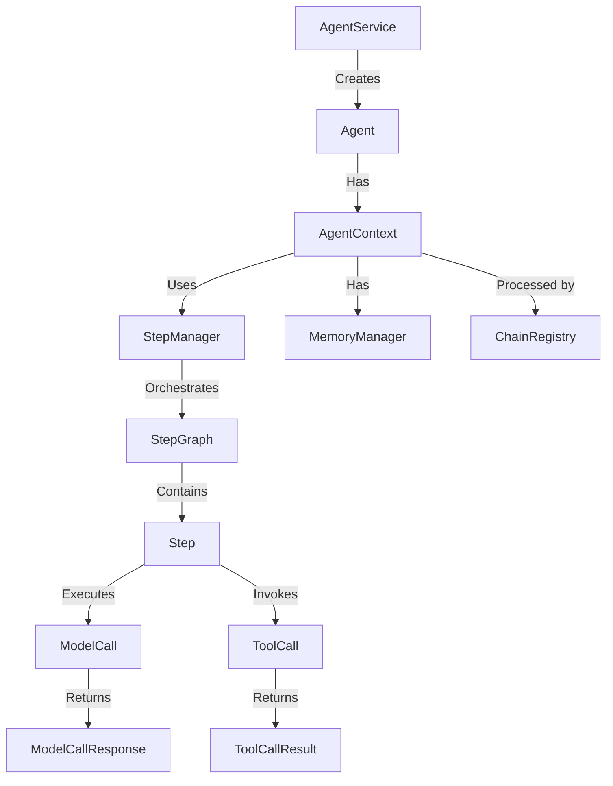
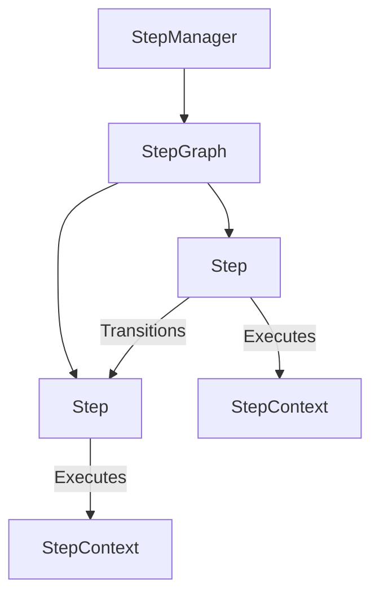
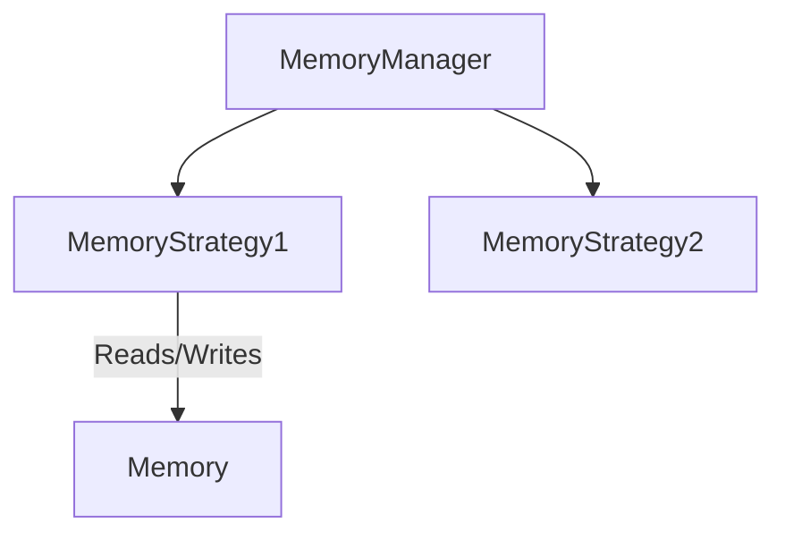
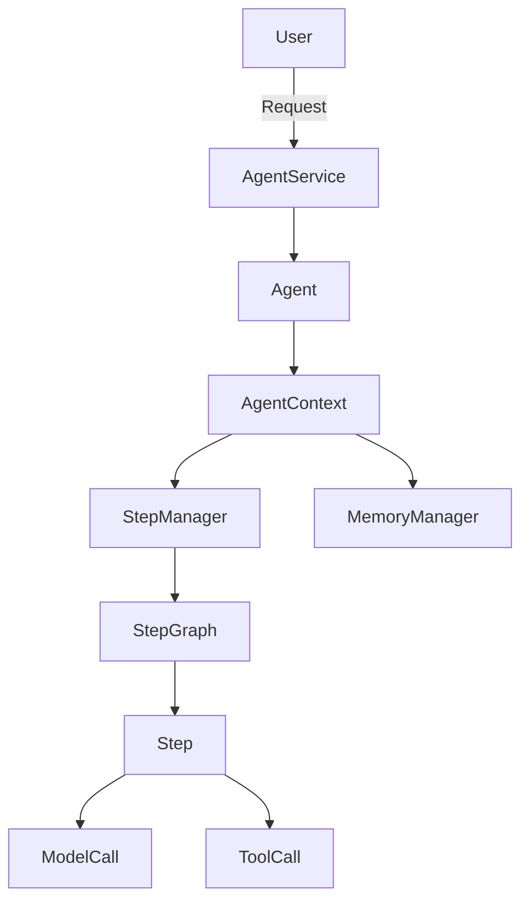
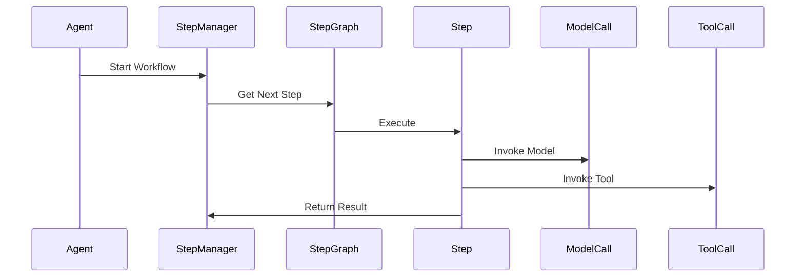

# MCP Framework Developer Guide

## Overview

The MCP (Model Context Protocol) framework is a modular, extensible Java framework for orchestrating agent workflows, memory management, step execution, model/tool calls, and advanced AI-driven automation. It is designed for:
- **Extensibility:** Plug in new agents, steps, memory strategies, models, and tools.
- **Testability:** Modular design with clear interfaces and test points.
- **Orchestration:** Chain-of-responsibility and strategy patterns for flexible workflows.

---

## Architecture



---

## Key Concepts & Packages

### 1. Agent Orchestration (`core.agent`)
- **AgentService:** Entry point for running agents. Wires up recipes, memory, and chains.
- **Agent:** Abstract base for all agents. Override to add custom logic, state, or tool selection.
- **AgentContext:** Carries all state/config for a single agent run.
- **AgentRecipe:** Defines agent config, step graph, memory, and tools.

**Extensibility:**
- Extend `Agent` for new agent types.
- Implement custom `AgentRecipeRepository` for dynamic recipes.

### 2. Step Orchestration (`core.step`)
- **Step:** Interface for a unit of work. Implement for custom actions/logic.
- **StepManager:** Orchestrates step execution and workflow progression.
- **StepGraph:** Defines step transitions (DAG, chain, etc.).
- **StepContext:** Execution context for a step.
- **StepCustomizer:** Decorate/modify steps at runtime.

**Extensibility:**
- Implement new `Step` types for custom logic.
- Extend `StepGraph` for advanced workflows (branching, loops).
- Implement `StepGraphCompletionStrategy` for custom completion logic.



### 3. Memory Management (`core.memory`)
- **MemoryManager:** Orchestrates memory strategies (short/long-term, external, etc.).
- **Memory:** Interface for memory backends.
- **MemoryStrategy:** Chainable strategies for memory operations.

**Extensibility:**
- Implement new `Memory` or `MemoryStrategy` for custom storage, retrieval, or summarization.
- Chain strategies for advanced memory architectures.



### 4. Model Calls (`core.model`)
- **ModelCall:** Represents a model invocation (LLM, etc.).
- **ModelCallExecutionContext:** All dependencies for executing a model call.
- **ModelCallResponse:** Output of a model call (messages, tool calls, etc.).

**Extensibility:**
- Extend `ModelCall` for custom orchestration or tracking.
- Implement adapters for new model providers.

### 5. Tool Calls (`core.tool`)
- **ToolCall:** Represents a tool invocation (API, function, etc.).
- **ToolDefinition:** Metadata and capabilities of a tool.
- **ToolRegistry:** Orchestrates tool registration, lookup, and validation.
- **DefaultToolRegistry:** Thread-safe, pluggable implementation.

**Extensibility:**
- Implement new `ToolDefinition` for custom tools.
- Extend `ToolRegistry` for advanced orchestration or validation.

---

## Chain of Responsibility & Strategy Patterns

- **ChainRegistry:** Pluggable chain-of-responsibility for agent/step/memory processing.
- **Processor:** Interface for processing contexts (agent, step, etc.).
- **Strategy:** Used in memory, step completion, and other extensible points.

---

## How to Extend the Framework

### Add a New Agent Type
```java
public class MyCustomAgent extends Agent {
    @Override
    public List<String> getAvailableTools() {
        // Return custom tool list
    }
    // Override other hooks as needed
}
```

### Add a Custom Step
```java
public class MyStep implements Step {
    // Implement required methods
}
```

### Add a Memory Strategy
```java
public class MyMemoryStrategy implements MemoryStrategy {
    // Implement memory operations
}
```

### Register a New Tool
```java
public class MyToolDefinition implements ToolDefinition {
    // Implement tool metadata and logic
}
```

---

## Best Practices
- Favor composition and chaining for extensibility.
- Use interfaces for pluggable logic (steps, memory, tools).
- Write unit tests for custom processors, strategies, and orchestration logic.
- Document new extension points clearly for future contributors.

---

## Diagrams

### High-Level Orchestration


### Step Execution Flow


---

## Contributing
- Fork the repo and create feature branches for new logic.
- Add/extend interfaces for new orchestration points.
- Write tests and documentation for all new features.
- Submit PRs with clear descriptions and usage examples.

---

## Further Reading
- See the `README.md` for getting started.
- Explore the `core/agent`, `core/step`, `core/memory`, `core/model`, and `core/tool` packages for extension points.
- Review Javadoc in source for detailed API documentation.

---

# Tutorial: Creating a Custom Agent

This tutorial walks you through creating a new agent using the MCP framework. You'll learn how to define a custom step, create an agent recipe, implement (optionally) a custom agent, and run your agent in a workflow.

## 1. Define a Custom Step

Steps are the building blocks of agent workflows. Implement the `Step` interface to define your own logic.

```java
import com.minionslab.core.step.Step;
import com.minionslab.core.message.Message;

public class GreetStep implements Step {
    @Override
    public void customize(StepCustomizer customizer) {
        // Optionally implement customization logic
    }

    @Override
    public String getId() {
        return "greet-step";
    }

    @Override
    public Message getGoal() {
        return new Message("Greet the user");
    }

    @Override
    public Message getSystemPrompt() {
        return new Message("Say hello to the user.");
    }

    @Override
    public String getType() {
        return "greet";
    }
}
```

## 2. Define an Agent Recipe

The recipe specifies the agent's workflow, memory, tools, and configuration.

```java
import com.minionslab.core.agent.AgentRecipe;
import com.minionslab.core.step.graph.StepGraph;
import com.minionslab.core.step.Step;

// Build your step graph (could be a simple list or a custom graph implementation)
StepGraph stepGraph = new SimpleStepGraph();
stepGraph.addStep(new GreetStep());

AgentRecipe recipe = AgentRecipe.builder()
    .id("greeting-agent")
    .systemPrompt("You are a friendly greeting agent.")
    .stepGraph(stepGraph)
    .requiredTools(List.of()) // Add tool names if needed
    .build();
```

## 3. (Optional) Implement a Custom Agent

For most use cases, the default agent is sufficient. To add custom logic, extend the `Agent` class:

```java
import com.minionslab.core.agent.Agent;
import com.minionslab.core.agent.AgentRecipe;
import com.minionslab.core.message.Message;

public class GreetingAgent extends Agent {
    public GreetingAgent(AgentRecipe recipe, Message userMessage) {
        super(recipe, userMessage);
    }
    @Override
    public List<String> getAvailableTools() {
        return List.of();
    }
}
```

## 4. Register and Run the Agent

Use `AgentService` to run your agent. This wires up the recipe, memory, and step orchestration.

```java
import com.minionslab.core.agent.AgentService;
import com.minionslab.core.agent.AgentContext;
import com.minionslab.core.message.DefaultMessage;
import com.minionslab.core.message.MessageRole;

AgentService agentService = ... // Obtain from Spring context or instantiate with dependencies

AgentContext result = agentService.runAgent(recipe, DefaultMessage.builder()
    .content("Hello!")
    .role(MessageRole.USER)
    .build());

System.out.println("Agent finished. Results: " + result.getResults());
```

## 5. Debugging and Testing Tips
- Write unit tests for your custom steps and agents.
- Use logging in your steps and agent logic to trace execution.
- Start with simple workflows and add complexity incrementally.
- Use the `StepContext` and `AgentContext` objects to inspect state at each stage.

---

This tutorial should help you get started building custom agents. For more advanced workflows, explore custom memory strategies, tool integrations, and step graphs!

---

*This guide is auto-generated and should be kept up to date as the framework evolves.* 