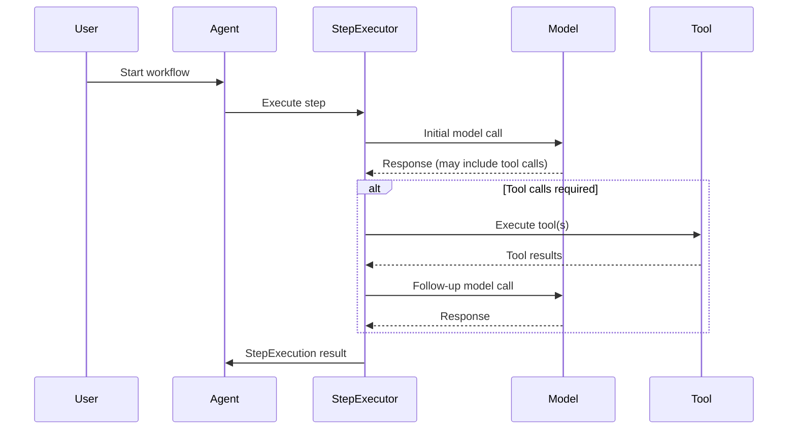
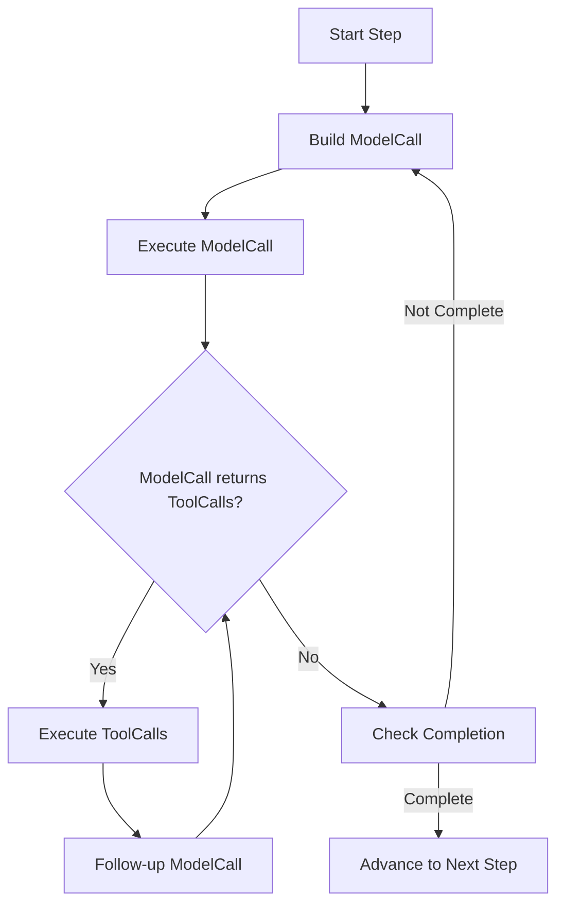
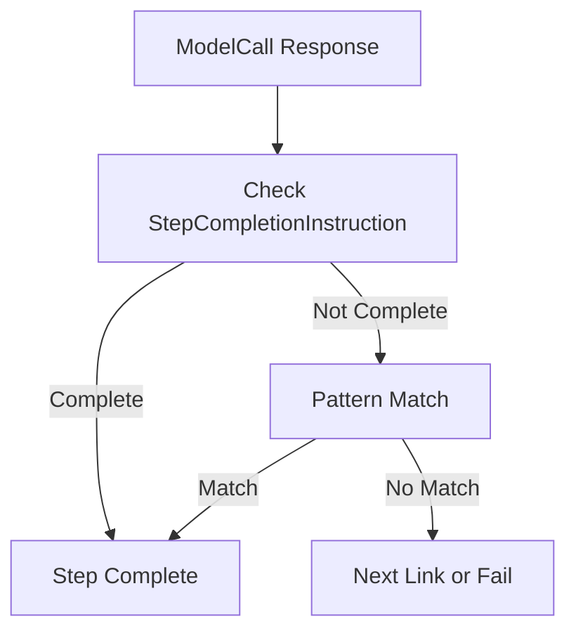
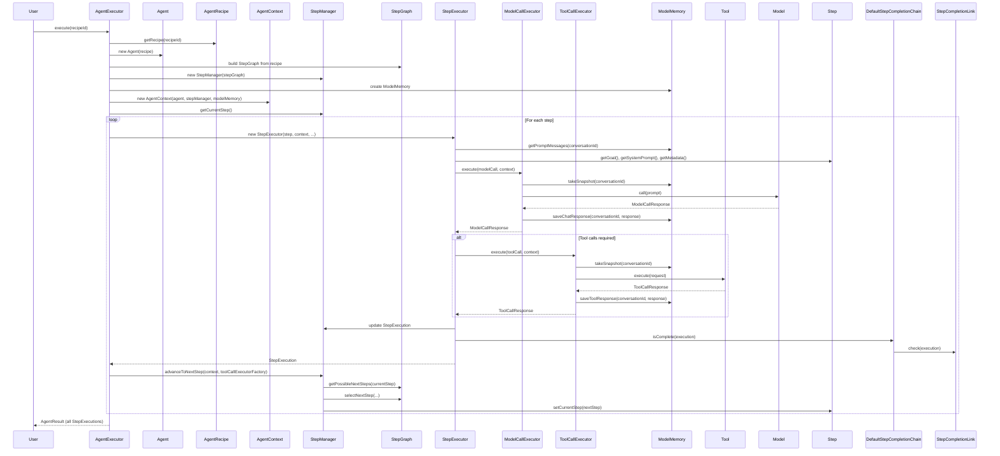

# Minions Agent Framework: Step Execution Module User Guide

---

## Table of Contents
1. [Overview](#overview)
2. [Architecture & Key Concepts](#architecture--key-concepts)
3. [Defining Steps and Workflows](#defining-steps-and-workflows)
4. [StepExecutor: Configuration & Usage](#stepexecutor-configuration--usage)
5. [Model Calls, Tool Calls, and Memory](#model-calls-tool-calls-and-memory)
6. [Structured Output & Output Instructions](#structured-output--output-instructions)
7. [Error Handling & Retries](#error-handling--retries)
8. [Extensibility Points](#extensibility-points)
9. [Example: Custom Workflow](#example-custom-workflow)
10. [Diagrams](#diagrams)
11. [Full Agent Execution Sequence Diagram](#full-agent-execution-sequence-diagram)

---

## Overview

The Minions Agent Framework provides a modular, extensible system for orchestrating multi-step, tool-augmented agent workflows. The `StepExecutor` module is the core engine for executing a single step, managing model calls, tool calls, memory, and completion logic.

---

## Architecture & Key Concepts

### Main Components
- **Step**: Represents a unit of work (goal, system prompt, available tools, completion criteria).
- **StepExecutor**: Orchestrates the execution of a single step, including model and tool calls, memory management, and completion.
- **ModelCall**: Encapsulates a request to an LLM or model provider.
- **ToolCall**: Represents a call to an external tool or function.
- **StepCompletionChain**: Chain-of-responsibility for determining when a step is complete.
- **ModelMemory**: Manages chat/memory state, supports snapshot/restore for retries.
- **OutputInstructions**: Encapsulates structured output requirements for the model.

### High-Level Execution Flow


---

## Defining Steps and Workflows

### Step Definition
A `Step` defines:
- **ID**: Unique identifier
- **Goal**: The objective for the step
- **System Prompt**: System-level instructions
- **Available Tools**: Set of tool names
- **Completion Criteria**: Logic for when the step is done

You can implement your own `Step` or use `DefaultStep`:
```java
DefaultStep step = new DefaultStep(
    "step1",
    messageBundle, // MessageBundle with system/user/goal messages
    Set.of("searchTool", "mathTool")
);
```

### Workflow Definition
A workflow is a sequence or graph of steps, managed by a `StepManager` and `StepGraph`.

---

## StepExecutor: Configuration & Usage

### Instantiating StepExecutor
```java
StepExecutor executor = new StepExecutor(
    step, // Step to execute
    agentContext, // AgentContext with memory, config, etc.
    modelCallExecutorFactory, // Factory for model call executors
    toolCallExecutorFactory   // Factory for tool call executors
);
```

### Executing a Step
```java
StepExecution result = executor.executeAsync().join();
```

### Configuration Options
- `maxModelCallsPerStep`: Maximum model calls per step (default: 10)
- `maxToolCallRetries`: Maximum retries for tool calls (default: 2)
- `sequentialToolCalls`: Whether to execute tool calls sequentially (default: false)

Set these in `AgentContext` metadata:
```java
agentContext.getMetadata().put("maxModelCallsPerStep", 5);
```

---

## Model Calls, Tool Calls, and Memory

### Model Calls
- Created from step goal, system prompt, and memory context
- Executed via a provider-specific `ModelCallExecutor`
- Can return tool call requests

### Tool Calls
- Executed in parallel or sequentially
- Support retries with memory snapshot/restore

### Memory Management
- `ModelMemory` supports `takeSnapshot` and `restoreSnapshot` for robust retries
- Memory is rolled back on failed model/tool call attempts

---

## Structured Output & Output Instructions

You can instruct the model to return structured output (e.g., JSON matching a schema) using `OutputInstructions`:

```java
OutputInstructions instructions = new OutputInstructions(
    List.of("You must output a JSON object matching the following schema."),
    "{ \"type\": \"object\", \"properties\": { \"name\": {\"type\": \"string\"} } }",
    MyOutputClass.class
);
Prompt prompt = new Prompt(messages, options, instructions);
```

The executor will include these instructions in the model call, and completion logic can inspect the structured output.

---

## Error Handling & Retries

- **Model and tool calls** are retried on failure, with memory rolled back to the last snapshot.
- Maximum retries are configurable.
- If all retries fail, the step is marked as failed and error details are recorded.

---

## Extensibility Points

- **Custom Step**: Implement your own `Step` for custom goal, prompt, or completion logic.
- **Custom ModelCallExecutor/ToolCallExecutor**: Plug in your own model/tool providers.
- **Custom StepCompletionChain**: Add or replace links in the completion chain for custom completion logic.
- **Custom OutputInstructions**: Define your own output schemas and instructions.

---

## Example: Custom Workflow

```java
// 1. Define steps
DefaultStep step1 = ...;
DefaultStep step2 = ...;

// 2. Build step graph and manager
StepGraph stepGraph = new DefaultStepGraph(List.of(step1, step2), ...);
StepManager stepManager = new StepManager(stepGraph);

// 3. Create agent context
AgentContext context = new AgentContext(agent, stepManager, modelMemory);

// 4. Create and run executor
StepExecutor executor = new StepExecutor(step1, context, modelCallExecutorFactory, toolCallExecutorFactory);
StepExecution result = executor.executeAsync().join();
```

---

## Diagrams

### Step Execution Flow


### Step Completion Chain


---

## Full Agent Execution Sequence Diagram

Below is a detailed sequence diagram showing how an `AgentExecutor` executes an agent with an `AgentRecipe`, including all major internal method calls and peripheral classes:



---

## Further Reading
- See the Javadoc in the source code for more details on each class and method.
- Explore the test suite for usage examples and edge cases.

---

Happy hacking with Minions! 🚀 